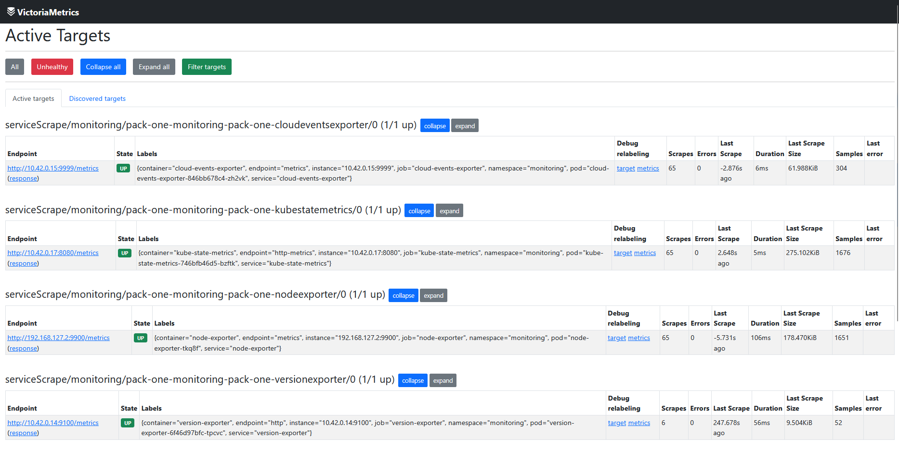
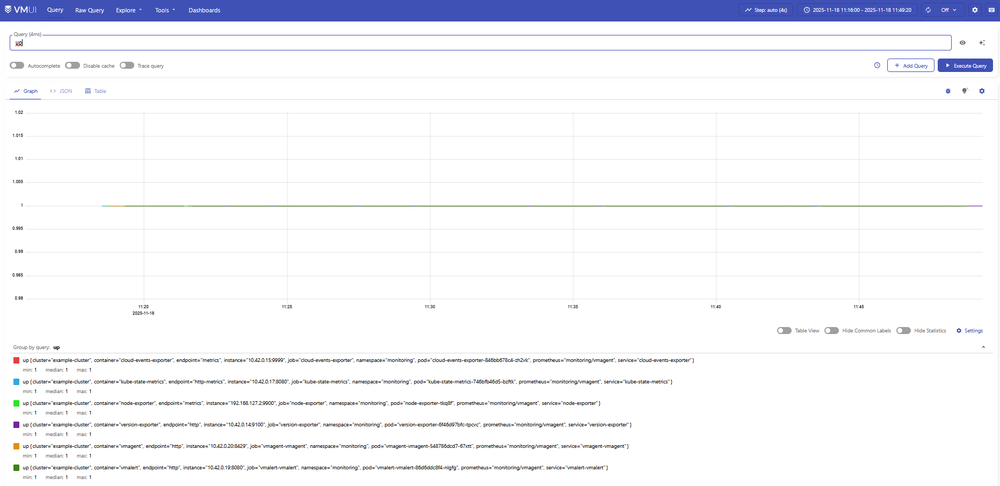

# Monitoring Pack Quickstart

This quickstart covers two deliverables:

1. **Operators-only baseline** – install Monitoring Operator, VictoriaMetrics Operator, and Grafana Operator with
nothing except the mandatory exporters.
2. **Pack-one** – extend that baseline with the minimal OPS bundle (vmagent, vmalert, ServiceMonitors, remote write).

Follow the sections below in order. The steps assume you already cloned this repository and have `kubectl` and `helm`
configured against your target cluster.

> **Namespaces used**
>
> - `monitoring` – all operators (Monitoring Operator, VictoriaMetrics Operator, Grafana Operator) and pack-one components.
> - `vmsingle-standalone` – a standalone VictoriaMetrics `vmsingle` instance for functional checks.

## 1. Install Grafana Operator CRDs

Grafana Operator CRDs must exist before Helm installs any resources that refer to them:

```bash
kubectl apply -f https://raw.githubusercontent.com/grafana/grafana-operator/v4.10.0/deploy/manifests/v4.10.0/crds.yaml
```

## 2. Deploy the baseline Monitoring Operator

Install the Monitoring Operator with only the mandatory exporters enabled (baseline scenario):

```bash
helm upgrade --install qubership-monitoring-operator \
  charts/qubership-monitoring-operator \
  --namespace monitoring \
  --create-namespace \
  -f docs/examples/deploy-parameters/monitoring-pack/operators-only-baseline-values.yaml
```

This chart deploys Monitoring Operator, VictoriaMetrics Operator, and Grafana Operator without any dashboards,
datasources, or VictoriaMetrics clusters.

## 3. Deploy a standalone vmsingle (optional test target)

Create an isolated namespace and apply the provided manifest to run a minimal VictoriaMetrics `vmsingle`. This instance
is useful for validating remote write from `vmagent`:

```bash
kubectl create namespace vmsingle-standalone
kubectl apply -f docs/examples/deploy-parameters/monitoring-pack/tests/vmsingle-direct.yaml
```

## 4. Install pack-one (OPS monitoring bundle)

This step covers the pack-one add-on. The chart delivers:

- `vmagent` configured with Remote Write to the test `vmsingle`
- `vmalert` plus default ServiceMonitors for the mandatory exporters
- RBAC required by VictoriaMetrics Operator

Install it into the same `monitoring` namespace:

```bash
helm upgrade --install pack-one docs/examples/deploy-parameters/monitoring-pack/pack-one \
  --namespace monitoring \
  -f docs/examples/deploy-parameters/monitoring-pack/pack-one/values.yaml
```

## 5. Port-forward for local troubleshooting

Expose both `vmagent` and the standalone `vmsingle` locally:

```bash
kubectl port-forward -n monitoring svc/vmagent-vmagent 18428:8429 &
kubectl port-forward -n vmsingle-standalone svc/vmsingle-k8s 18429:8429 &
```

Access the UIs/APIs through a browser or API client:

- `vmagent`: [http://127.0.0.1:18428](http://127.0.0.1:18428)
- `vmsingle`: [http://127.0.0.1:18429](http://127.0.0.1:18429)

### 6. Validate the data flow

1. **vmagent targets** – open [http://127.0.0.1:18428/targets](http://127.0.0.1:18428/targets) and check that all
mandatory exporter targets are in the `UP` state.

   

2. **vmsingle query** – open [http://127.0.0.1:18429/vmui/](http://127.0.0.1:18429/vmui/) → `Query`, type `up`, run the
query, and confirm that vmagent’s scraped metrics arrive in vmsingle (results should include the exporters you enabled).

   

---

Outcome:

1. Baseline operators installed with only mandatory exporters (task “operators-only baseline”).
2. Pack-one deployed on top of that baseline, sending metrics to the test `vmsingle` (task “pack-one OPS bundle”).
