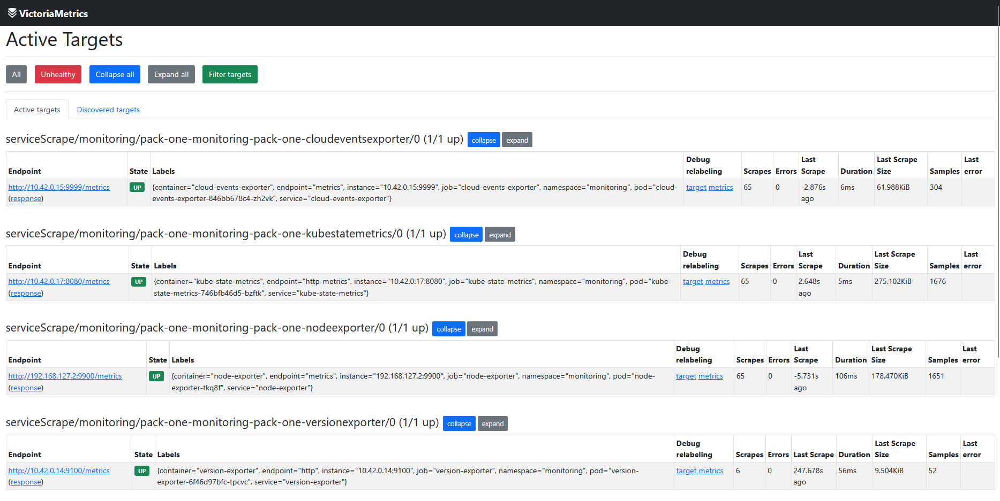
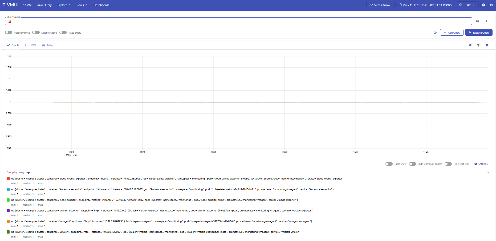

# Monitoring Pack Quickstart

## Why Monitoring Pack?

Monitoring Pack is a modular monitoring deployment architecture that allows you to install monitoring components
incrementally based on team needs. This solution is particularly useful for:

- **Separation of responsibilities**: OPS teams can deploy a basic monitoring set (pack-one), while DEV teams can add
their own dashboards and alerts (pack-two) without interfering with the shared infrastructure
- **Data isolation**: Each team can have its own VictoriaMetrics instance for storing metrics while reusing shared
exporters
- **Configuration flexibility**: Ability to configure different Grafana instances with different dashboards and
datasources
- **Gradual deployment**: Start with a minimal baseline (operators only), then add the OPS set, and finally the DEV set
as needed

This quickstart covers three components:

1. **Operators-only baseline** – install Monitoring Operator, VictoriaMetrics Operator, and Grafana Operator with
nothing except the mandatory exporters.
2. **Pack-one** – extend that baseline with the minimal OPS bundle (vmagent, vmalert, ServiceMonitors, remote write)
plus shared exporter configuration.
3. **Pack-two** – provision a DEV-focused monitoring bundle (dedicated VMSingle/VMAgent/VMAlert, Grafana objects, and
ingress) that reuses the exporters from pack-one via label selectors.

Follow the sections below in order. The steps assume you already cloned this repository and have `kubectl` and `helm`
configured against your target cluster.

> **Namespaces used**
>
> - `monitoring` – all operators (Monitoring Operator, VictoriaMetrics Operator, Grafana Operator);
> - `pack-one` – pack-one components (VMAgent, VMAlert, VMAuth, VMUser);
> - `pack-two` – pack-two components (DEV VMSingle/VMAgent/VMAlert/VMAuth, Grafana resources);
> - `vmsingle-standalone` – a standalone VictoriaMetrics `vmsingle` instance for functional checks;

## 1. Deploy the baseline Monitoring Operator

Install the Monitoring Operator with only the mandatory exporters enabled (baseline scenario):

```bash
helm upgrade --install qubership-monitoring-operator \
  charts/qubership-monitoring-operator \
  --namespace monitoring \
  --create-namespace \
  -f docs/examples/deploy-parameters/monitoring-pack/operators-only-baseline-values.yaml
```

This chart deploys Monitoring Operator, VictoriaMetrics Operator, and Grafana Operator without any dashboards,
datasources, or VictoriaMetrics clusters.

**Mandatory exporters** installed in the baseline:
- **nodeExporter** – collects node-level metrics (CPU, memory, disk, network)
- **kubeStateMetrics** – collects Kubernetes object state metrics (pods, nodes, services, etc.)
- **cloudEventsExporter** – exports cloud infrastructure events
- **versionExporter** – exports component version information

These exporters provide basic infrastructure and Kubernetes metrics necessary for cluster monitoring.

## 2. Deploy a standalone vmsingle (optional test target)

Create an isolated namespace and apply the provided manifest to run a minimal VictoriaMetrics `vmsingle`. This instance
is useful for validating remote write from `vmagent`:

```bash
kubectl create namespace vmsingle-standalone
kubectl apply -f docs/examples/deploy-parameters/monitoring-pack/tests/vmsingle-direct.yaml
```

## 3. Deploy test resources for checking Grafana resources managed by the operator (optional test target)

This step together with the previous one creates a test `GrafanaFolder`, `GrafanaDatasource`, and `GrafanaDashboard`
for the baseline Grafana deployment managed by Grafana Operator in the `monitoring` namespace. This allows you to verify
that Grafana Operator correctly manages Grafana resources and binds them to the expected Grafana instance.

```bash
kubectl apply -f docs/examples/deploy-parameters/monitoring-pack/monitoring-folder.yaml
kubectl apply -f docs/examples/deploy-parameters/monitoring-pack/monitoring-vmsingle-datasource.yaml
kubectl apply -f docs/examples/deploy-parameters/monitoring-pack/monitoring-test-dashboard.yaml
```

## 4. Install pack-one (OPS monitoring bundle)

Pack-one acts as the operational baseline: it wires the mandatory exporters to a managed VMAgent/VMSingle pair, ships a
starter alerting pipeline, and exposes the endpoints through VMAuth/Ingress so OPS teams can observe the platform even
before DEV-focused features (like pack-two dashboards) are installed. The chart delivers:

- `vmagent` configured with Remote Write to the test `vmsingle`
- `vmalert` plus default ServiceMonitors for the mandatory exporters
- `vmauth` for authentication and routing (optional)
- `vmuser` CRD for user credentials and routing configuration (optional)
- Ingress resources for external access (optional)
- RBAC required by VictoriaMetrics Operator

Install it in `pack-one` namespace:

```bash
helm upgrade --install pack-one docs/examples/deploy-parameters/monitoring-pack/pack-one \
  --namespace pack-one \
  --create-namespace \
  -f docs/examples/deploy-parameters/monitoring-pack/pack-one/values.yaml
```

> **Shared exporters label**: every ServiceMonitor rendered by pack-one automatically receives the
> `monitoring-pack: "one"` label. Override `monitoringPackLabel` in `values.yaml` if you need a different value.
> Downstream bundles (for example, pack-two) rely on this label to reuse exporters.

### 4.1. Configure VMAuth and VMUser (optional)

By default, VMAuth and VMUser are installed with basic authentication (`admin/admin`). VMAuth automatically discovers
VMUser resources using the label selector `app.kubernetes.io/name: vmuser` together with the pack-specific
`monitoring-pack` label. Routing is automatically configured to route requests to installed components (`vmagent`,
`vmsingle`, and `vmalert` when enabled) based on path patterns.

**For pack-one** (`pack-one/values.yaml`):

1. **Update credentials**:
   ```yaml
   vmUser:
     install: true
     spec:
       username: your-username
       password: your-password
       # Or use passwordRef for secret-based authentication
       # passwordRef:
       #   name: vmuser-secret
       #   key: password
   ```

2. **VMAuth configuration** (if needed):
   ```yaml
   vmAuth:
     install: true
     spec:
       selectAllByDefault: false  # Default: false - uses userSelector to find VMUser
       # userSelector: {}  # Default: matches app.kubernetes.io/name: vmuser + monitoring-pack: one
       # userNamespaceSelector: {}  # Default: empty (searches in all namespaces)
   ```

**For pack-two** (`pack-two/values.yaml`):

By default pack-two deploys `vmuser-dev` with `admin/admin` credentials and labels that limit VMAuth discovery to
pack-two users only:

```yaml
vmUser:
  install: true
  spec:
    username: your-username
    passwordRef:
      name: vmuser-secret
      key: password
    # or use bearerToken / tokenRef for API access tokens
vmAuth:
  spec:
    # Optional: broaden discovery to multiple monitoring packs
    userSelector:
      matchLabels:
        app.kubernetes.io/name: vmuser
        monitoring-pack: "two"
```

### 4.2. Configure Ingress (optional)

To enable Ingress resources:

**For pack-one** (`pack-one/values.yaml`):

```yaml
ingress:
  install: true
  vmAuth:
    host: vmauth.example.com
    ingressClassName: traefik # default controller in the quickstart cluster
    servicePort: 8427
    # Optional: TLS configuration
    # tlsSecretName: vmauth-tls
  vmAgent:
    host: vmagent.example.com
    ingressClassName: traefik
    servicePort: 8429
  vmSingle:
    host: vmsingle.example.com
    ingressClassName: traefik
    servicePort: 8429
  vmalert:
    host: vmalert.example.com
    ingressClassName: traefik
    servicePort: 8080
```

**For pack-two** (`pack-two/values.yaml`):

```yaml
ingress:
  install: true
  vmAuth:
    host: vmauth-dev.example.com
    ingressClassName: traefik
    servicePort: 8427
  vmAgent:
    host: vmagent-dev.example.com
    ingressClassName: traefik
    servicePort: 8429
  vmSingle:
    host: vmsingle-dev.example.com
    ingressClassName: traefik
    servicePort: 8429
  vmalert:
    host: vmalert-dev.example.com
    ingressClassName: traefik
    servicePort: 8080
  grafana:
    host: grafana-dev.example.com
    ingressClassName: traefik
    servicePort: 3000
```

**Access services**:
- **pack-one**: `http://vmauth.example.com`, `http://vmagent.example.com`, `http://vmsingle.example.com`, `http://vmalert.example.com`
- **pack-two**: `http://vmauth-dev.example.com`, `http://vmagent-dev.example.com`, `http://vmsingle-dev.example.com`, `http://vmalert-dev.example.com`, `http://grafana-dev.example.com`
- If TLS is configured, use `https://` instead of `http://`

> **Note**: If VMAuth is enabled, access vmagent, vmsingle, and vmalert through VMAuth using the configured credentials.

## 5. Install pack-two (DEV monitoring bundle)

Pack-two targets development teams that need their own VictoriaMetrics + Grafana stack while still scraping the shared
exporters delivered by pack-one. The chart installs:

1. **VMSingle** – a DEV-only VictoriaMetrics cluster (`vmSingle`)
2. **VMAgent** – collects metrics from both `monitoring-pack=one` and `monitoring-pack=two` ServiceMonitors
3. **VMAlert** – rules and alert delivery scoped to DEV workloads
4. **VMAuth / VMUser** (optional) – authentication and routing facade for DEV access
5. **ServiceMonitors** – pack-two specific exporters (each labeled `monitoring-pack: "two"`)
6. **Grafana objects** – datasource, example dashboards, and alerting rules bound to the DEV VMSingle

### 5.1 Reusing pack-one exporters

1. Ensure pack-one ServiceMonitors carry `monitoring-pack: "one"` (this is automatic unless you override
`monitoringPackLabel`).
2. Pack-two's VMAgent is rendered with `serviceScrapeSelector.matchExpressions` that includes both `"one"` and `"two"`,
so it automatically discovers the shared exporters alongside its own.
3. Each pack still keeps an isolated storage/alerting stack—only the scrape configuration is shared.

**How ServiceMonitors are used now:**

- **In pack-one**, ServiceMonitor objects are created only for the four mandatory exporters from the baseline
  (`kube-state-metrics`, `node-exporter`, `cloud-events-exporter`, `version-exporter`). They live in a single, fixed
  namespace (by default `monitoring`) and are labeled with `monitoring-pack: "one"`, so both pack-one and pack-two
  can safely reuse them.
- **In pack-two**, the chart does not recreate these mandatory ServiceMonitors. Instead, it reuses the ones from
  pack-one via label selectors and provides a simple template for adding *additional* ServiceMonitors for DEV-specific
  exporters when needed.

### 5.2 Install pack-two

> **Note**: Pack-two assumes VictoriaMetrics Operator is already running (from baseline/pack-one) in the `monitoring`
> namespace. If your operator lives elsewhere, update `vmOperatorNamespace` in
> `docs/examples/deploy-parameters/monitoring-pack/pack-two/values.yaml` before installing.

```bash
helm upgrade --install pack-two docs/examples/deploy-parameters/monitoring-pack/pack-two \
  --namespace pack-two \
  --create-namespace \
  -f docs/examples/deploy-parameters/monitoring-pack/pack-two/values.yaml
```

### 5.3 Grafana and Dashboards

#### 5.3.1 Brief explanation of how Grafana Operator works

Grafana Operator manages the lifecycle of Grafana instances and related resources (dashboards, datasources, folders,
alerting rules) through Custom Resources (CR). The operator monitors changes in these resources and synchronizes them
with actual Grafana instances.

**Main components:**
- **Grafana Operator Deployment** – deployed in the `monitoring` namespace, manages all Grafana resources
- **Grafana CR** – defines a Grafana instance (Deployment, Service, ConfigMap, etc.)
- **GrafanaDashboard CR** – defines a dashboard that will be imported into Grafana
- **GrafanaDatasource CR** – defines a datasource for connecting to metrics storage (e.g., VMSingle)

#### 5.3.2 Cross-namespace configuration

Grafana configuration resources (dashboards, datasources, folders, alerting rules) can be located in different
namespaces than where the Grafana instance is deployed. This allows teams to manage their dashboards independently while
using a shared Grafana instance.

**To connect resources from another namespace:**

1. **Set `allowCrossNamespaceImport: true`** in the resource's `spec` (GrafanaDashboard, GrafanaDatasource,
GrafanaFolder, or GrafanaAlertRuleGroup):

   ```yaml
   spec:
     allowCrossNamespaceImport: true
     instanceSelector:
       matchLabels:
         monitoring-pack: "two"
   ```

2. **Configure `instanceSelector`** to specify which Grafana instance to connect to (see section 5.3.3)

3. **Ensure Grafana Operator tracks the namespace** where resources are located (see section 5.3.3)

#### 5.3.3 Configuring resource filtering

Filtering which dashboards and other resources will be connected to a Grafana instance happens at two levels:

**Recommended approach used in this quickstart:**

1. **At the operator level**: Specify `watchNamespaces` in Grafana Operator configuration to limit tracked namespaces:
   ```yaml
   # In operators-only-baseline-values.yaml
   grafana:
     operator:
       watchNamespaces: ""  # Operator tracks all namespaces, binding is controlled by instanceSelector
   ```

2. **At the resource level**: Use a simple label in `instanceSelector.matchLabels` for binding:
   ```yaml
   # In dashboard/datasource
   spec:
     allowCrossNamespaceImport: true
     instanceSelector:
       matchLabels:
         monitoring-pack: "two"
   ```

   And ensure the Grafana CR has the corresponding label:
   ```yaml
   # In Grafana CR
   metadata:
     labels:
       monitoring-pack: "two"
   ```

> **Important**: If `watchNamespaces` is left empty (`""`), the operator will track all namespaces in the cluster. In
this case, resource selection will occur only by `instanceSelector`. This may impact performance in loaded systems as
the operator will process more resources.

**Interaction of `instanceSelector` and `allowCrossNamespaceImport`:**

- **Empty `instanceSelector: {}`** (without cross-namespace): the resource is applied only to Grafana instances in the
  **same namespace** as the dashboard/datasource (per Grafana Operator behaviour).
- **Empty `instanceSelector: {}` with `allowCrossNamespaceImport: true`**: the operator applies the resource to **all**
  Grafana instances in the namespaces specified in `watchNamespaces` (WATCH_NAMESPACE). So a pack-two dashboard with
  `instanceSelector: {}` and `allowCrossNamespaceImport: true` will appear in both baseline Grafana (monitoring) and
  pack-two Grafana. To limit dashboards to a single instance, use an explicit `instanceSelector` (e.g.
  `matchLabels: monitoring-pack: "two"`).
- **`allowCrossNamespaceImport: false`**: the resource is limited to Grafana instances in the **same namespace** as the
  dashboard/datasource. Use `allowCrossNamespaceImport: true` only when the dashboard/datasource and the Grafana instance
  are in different namespaces.

**Additional capabilities (for advanced scenarios):**

If the recommended approach is insufficient, additional filtering mechanisms are available that can be combined:

- **At the operator level**: Three operator parameters:
  - `watchNamespaces` – comma-separated list of namespaces (e.g., `"monitoring,pack-two"`)
  - `watchNamespaceSelector` – label selector for dynamic namespace discovery (e.g., `"monitoring.enabled=true"`)
  - `watchLabelSelectors` – label selector for filtering CRs by their labels (e.g., `"environment=production"`)
  
  For more details, see the [Grafana Operator Helm chart documentation](https://grafana.github.io/grafana-operator/docs/installation/helm/).

- **At the Grafana instance level**: The `instanceSelector` parameter in resources (GrafanaDashboard, GrafanaDatasource, etc.):
  - `matchLabels` – exact label matching
  - `matchExpressions` – flexible expressions for label matching (In, NotIn, Exists, DoesNotExist)
  
  For more details, see the [Grafana Operator v5 documentation](https://grafana.github.io/grafana-operator/docs/api/#grafanadashboardspec).

#### 5.3.4 Separate Deployment for Grafana instances

Monitoring Pack implements the ability to create separate Grafana instances for different teams or environments. Each
Grafana instance has its own Deployment and operates independently, while all instances are managed by a single Grafana
Operator.

**Example:**
- **Baseline Grafana** (namespace `monitoring`): used by the OPS team, test resources bind to it via `app.kubernetes.io/instance: grafana-monitoring`
- **Pack-two Grafana** (namespace `pack-two`): used by the DEV team, dashboards/datasource bind to it via `monitoring-pack: "two"`

Each instance can have its own dashboards, datasources, and settings, while they are isolated from each other at the
Deployment level.

## 6. Access services
If Ingress is enabled, access services through the configured hosts:

- **Baseline Grafana**: `https://grafana.example.com`
- **Pack-one VMAuth**: `http://vmauth.example.com` (authenticate with credentials from `vmUser.spec`, default: `admin/admin`)
  - Access VMUI through VMAuth: `http://vmauth.example.com/vmui/`
  - Access vmagent through VMAuth: `http://vmauth.example.com/targets`
- **Pack-one VMAgent**: `http://vmagent.example.com` (or through VMAuth if enabled)
- **Pack-one VMSingle**: `http://vmsingle.example.com` (or through VMAuth if enabled)
- **Pack-one VMAlert**: `http://vmalert.example.com` (or through VMAuth if enabled)
- **Pack-two VMAuth**: `http://vmauth-dev.example.com`
- **Pack-two VMAgent**: `http://vmagent-dev.example.com` (or through VMAuth if enabled)
- **Pack-two VMSingle**: `http://vmsingle-dev.example.com` (or through VMAuth if enabled)
- **Pack-two VMAlert**: `http://vmalert-dev.example.com` (or through VMAuth if enabled)
- **Pack-two Grafana**: `https://grafana-dev.example.com`

## 7. Validate the data flow

1. **vmagent targets** – open the vmagent UI via Ingress → `/targets` and check that all mandatory
exporter targets are in the `UP` state.

   

2. **vmsingle query** – open the vmsingle UI via Ingress → `/vmui/` → `Query`, type `up`, run the
query, and confirm that vmagent's scraped metrics arrive in vmsingle (results should include the exporters you enabled).

   

3. **VMAuth routing** (if enabled) – access vmagent or vmsingle through VMAuth using the configured credentials
(`admin/admin` by default).
   - Access VMUI: `http://vmauth.example.com/vmui/`
   - Access vmagent targets: `http://vmauth.example.com/targets`
   - Access vmsingle query: `http://vmauth.example.com/vmui/query`
   
The VMAuth service automatically routes requests to the appropriate backend (vmagent or vmsingle) based on the path
patterns defined in VMUser's targetRefs. The root path `/` is included to support VMUI access.
